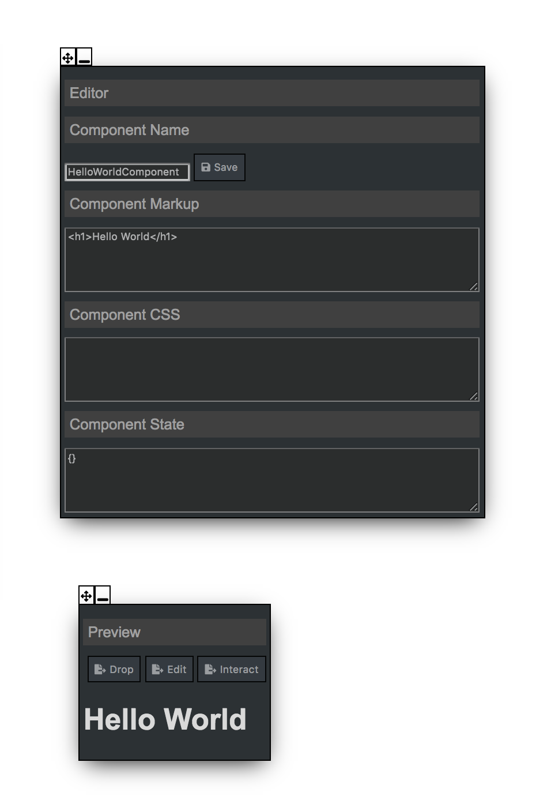

# Component

UI Editor works on basis of a concept called component. Content to a component is provided by JSX, visual appearance are controled by adding classes to tags. 

Here is an example HelloComponent.

{:height="100px"}

## Interactive Component

A component with state can have dynamic content by binding reducers to events. Reducers take the previous state, modifies it and returns a new state. After a state is changed, component rerenders with the fresh state.

Here is an example HelloComponent displaying different content on click of a button.

IMAGE || GIF

State can also be used to change visual appearance of a component.

Here is an example of a component with different visual appearance changed by different events. It works by appliying different classes for differen events.

IMAGE || GIF

## Component Composition - Build bigger components using smaller components

A component can be composed of sub components by setting preview tool on drop mode.

Here is an example of composing component by droppping a previously created component.

IMAGE || GIF

A parent component can subscribe to child component's events. In order to subscribe to child component's events, make sure the event is a publishable event.

Here is an example of parent component displaying content based on state published by the child component.

IMAGE || GIF

A component created using this tool can be converted to any choice of framework. Here is an example of code generation to a popular code called ReactJS.